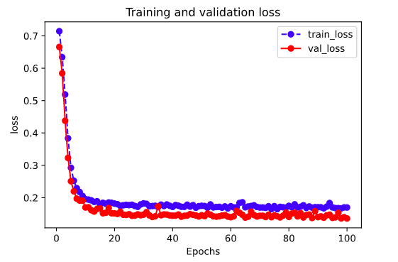
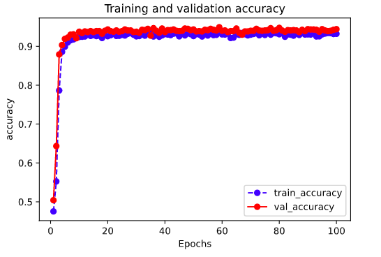

# 1，Introduction

<!-- #region -->
The torchkeras library is a simple tool for training neural network in pytorch jusk like in a keras style. 😋😋

With torchkeras, You need not to write your training loop with many lines of code, all you need to do is just 

like this three steps as below:

(i) create your network and wrap it with torchkeras.Model like this: `model = torchkeras.Model(net)` 

(ii) compile your model to 	bind the loss function, the optimizer and the metrics function.

(iii) fit your model with the training data and validate data.

**This project seems somehow powerful, but the source code is very simple.**

**Actually, less than 200 lines of Python code.**

**If you want to understand or modify some details of this project, feel free to read and change the source code!!!**


<br/>

🍉🍉 **new feature**🍉🍉: torchkeras.LightModel 😋😋

it's more powerful than torchkeras.Model and with more flexibility and easier to use!

the tutorial of torchkeras.LightModel is here:

**[Use Pytorch-Lightning Like Keras ](./Tutorial.md)**


<br/>


<!-- #endregion -->

# 2,  Use example


You can install torchkeras using pip:
`pip install torchkeras`


Here is a complete examples using torchkeras! 

```python
import numpy as np 
import pandas as pd 
from matplotlib import pyplot as plt
import torch
from torch import nn
import torch.nn.functional as F
from torch.utils.data import Dataset,DataLoader,TensorDataset

import torchkeras #Attention this line 


```

### (1) prepare data 

```python
%matplotlib inline
%config InlineBackend.figure_format = 'svg'

#number of samples
n_positive,n_negative = 2000,2000

#positive samples
r_p = 5.0 + torch.normal(0.0,1.0,size = [n_positive,1]) 
theta_p = 2*np.pi*torch.rand([n_positive,1])
Xp = torch.cat([r_p*torch.cos(theta_p),r_p*torch.sin(theta_p)],axis = 1)
Yp = torch.ones_like(r_p)

#negative samples
r_n = 8.0 + torch.normal(0.0,1.0,size = [n_negative,1]) 
theta_n = 2*np.pi*torch.rand([n_negative,1])
Xn = torch.cat([r_n*torch.cos(theta_n),r_n*torch.sin(theta_n)],axis = 1)
Yn = torch.zeros_like(r_n)

#concat positive and negative samples
X = torch.cat([Xp,Xn],axis = 0)
Y = torch.cat([Yp,Yn],axis = 0)


#visual samples
plt.figure(figsize = (6,6))
plt.scatter(Xp[:,0],Xp[:,1],c = "r")
plt.scatter(Xn[:,0],Xn[:,1],c = "g")
plt.legend(["positive","negative"]);
```


```python
# split samples into train and valid data.
ds = TensorDataset(X,Y)
ds_train,ds_valid = torch.utils.data.random_split(ds,[int(len(ds)*0.7),len(ds)-int(len(ds)*0.7)])
dl_train = DataLoader(ds_train,batch_size = 100,shuffle=True,num_workers=2)
dl_valid = DataLoader(ds_valid,batch_size = 100,num_workers=2)
```

### (2) create the  model

```python
class Net(nn.Module):  
    def __init__(self):
        super().__init__()
        self.fc1 = nn.Linear(2,4)
        self.fc2 = nn.Linear(4,8) 
        self.fc3 = nn.Linear(8,1)
        
    def forward(self,x):
        x = F.relu(self.fc1(x))
        x = F.relu(self.fc2(x))
        y = nn.Sigmoid()(self.fc3(x))
        return y
        
net = Net()

### Attention here
model = torchkeras.Model(net)
model.summary(input_shape =(2,))
```

```
----------------------------------------------------------------
        Layer (type)               Output Shape         Param #
================================================================
            Linear-1                    [-1, 4]              12
            Linear-2                    [-1, 8]              40
            Linear-3                    [-1, 1]               9
================================================================
Total params: 61
Trainable params: 61
Non-trainable params: 0
----------------------------------------------------------------
Input size (MB): 0.000008
Forward/backward pass size (MB): 0.000099
Params size (MB): 0.000233
Estimated Total Size (MB): 0.000340
----------------------------------------------------------------
```


### (3) train the model

```python
# define metric
def accuracy(y_pred,y_true):
    y_pred = torch.where(y_pred>0.5,torch.ones_like(y_pred,dtype = torch.float32),
                      torch.zeros_like(y_pred,dtype = torch.float32))
    acc = torch.mean(1-torch.abs(y_true-y_pred))
    return acc

# if gpu is available, use gpu
device = torch.device("cuda:0" if torch.cuda.is_available() else "cpu")

model.compile(loss_func = nn.BCELoss(),optimizer= torch.optim.Adam(model.parameters(),lr = 0.01),
             metrics_dict={"accuracy":accuracy},device = device)

dfhistory = model.fit(epochs=10, dl_train=dl_train, dl_val=dl_valid)
```

```
Epoch 1 / 10
[========================================] 100%	loss: 0.6477    accuracy: 0.5818    val_loss: 0.6336    val_accuracy: 0.5500

Validation loss decreased (inf --> 0.633563).  Saving model ...
Epoch 2 / 10
[========================================] 100%	loss: 0.5909    accuracy: 0.6846    val_loss: 0.5577    val_accuracy: 0.7058

Validation loss decreased (0.633563 --> 0.557686).  Saving model ...
Epoch 3 / 10
[========================================] 100%	loss: 0.5133    accuracy: 0.7439    val_loss: 0.4690    val_accuracy: 0.7617

Validation loss decreased (0.557686 --> 0.469044).  Saving model ...
Epoch 4 / 10
[========================================] 100%	loss: 0.4162    accuracy: 0.7729    val_loss: 0.3827    val_accuracy: 0.8525

Validation loss decreased (0.469044 --> 0.382657).  Saving model ...
Epoch 5 / 10
[========================================] 100%	loss: 0.3343    accuracy: 0.8836    val_loss: 0.2852    val_accuracy: 0.9000

Validation loss decreased (0.382657 --> 0.285220).  Saving model ...
Epoch 6 / 10
[========================================] 100%	loss: 0.2718    accuracy: 0.9036    val_loss: 0.2496    val_accuracy: 0.9075

Validation loss decreased (0.285220 --> 0.249568).  Saving model ...
Epoch 7 / 10
[========================================] 100%	loss: 0.2363    accuracy: 0.9125    val_loss: 0.2266    val_accuracy: 0.9100

Validation loss decreased (0.249568 --> 0.226555).  Saving model ...
Epoch 8 / 10
[========================================] 100%	loss: 0.2220    accuracy: 0.9157    val_loss: 0.2078    val_accuracy: 0.9142

Validation loss decreased (0.226555 --> 0.207836).  Saving model ...
Epoch 9 / 10
[========================================] 100%	loss: 0.2069    accuracy: 0.9214    val_loss: 0.2357    val_accuracy: 0.8942

EarlyStopping counter: 1 out of 10
Epoch 10 / 10
[========================================] 100%	loss: 0.2164    accuracy: 0.9071    val_loss: 0.2221    val_accuracy: 0.9067

EarlyStopping counter: 2 out of 10
```

```python
# visual the results
fig, (ax1,ax2) = plt.subplots(nrows=1,ncols=2,figsize = (12,5))
ax1.scatter(Xp[:,0],Xp[:,1], c="r")
ax1.scatter(Xn[:,0],Xn[:,1],c = "g")
ax1.legend(["positive","negative"]);
ax1.set_title("y_true")

Xp_pred = X[torch.squeeze(model.forward(X)>=0.5)]
Xn_pred = X[torch.squeeze(model.forward(X)<0.5)]

ax2.scatter(Xp_pred[:,0],Xp_pred[:,1],c = "r")
ax2.scatter(Xn_pred[:,0],Xn_pred[:,1],c = "g")
ax2.legend(["positive","negative"]);
ax2.set_title("y_pred")
```


### (4) evaluate the model

```python
%matplotlib inline
%config InlineBackend.figure_format = 'svg'

import matplotlib.pyplot as plt

def plot_metric(dfhistory, metric):
    train_metrics = dfhistory[metric]
    val_metrics = dfhistory['val_'+metric]
    epochs = range(1, len(train_metrics) + 1)
    plt.plot(epochs, train_metrics, 'bo--')
    plt.plot(epochs, val_metrics, 'ro-')
    plt.title('Training and validation '+ metric)
    plt.xlabel("Epochs")
    plt.ylabel(metric)
    plt.legend(["train_"+metric, 'val_'+metric])
    plt.show()
```

```python
plot_metric(dfhistory,"loss")
```



```python
plot_metric(dfhistory,"accuracy")
```




```python
model.evaluate(dl_valid)
```

```
{'val_loss': 0.13576620258390903, 'val_accuracy': 0.9441666702429453}
```


### (5) use the model

```python
model.predict(dl_valid)[0:10]
```

```
tensor([[0.8767],
        [0.0154],
        [0.9976],
        [0.9990],
        [0.9984],
        [0.0071],
        [0.3529],
        [0.4061],
        [0.9938],
        [0.9997]])
```

```python
for features,labels in dl_valid:
    with torch.no_grad():
        predictions = model.forward(features)
        print(predictions[0:10])
    break
```

```
tensor([[0.9979],
        [0.0011],
        [0.9782],
        [0.9675],
        [0.9653],
        [0.9906],
        [0.1774],
        [0.9994],
        [0.9178],
        [0.9579]])
```

### (6) save the model

```python
# save the model parameters

torch.save(model.state_dict(), "model_parameter.pkl")

model_clone = torchkeras.Model(Net())
model_clone.load_state_dict(torch.load("model_parameter.pkl"))

model_clone.compile(loss_func = nn.BCELoss(),optimizer= torch.optim.Adam(model.parameters(),lr = 0.01),
             metrics_dict={"accuracy":accuracy})

model_clone.evaluate(dl_valid)
```

```
{'val_loss': 0.17422042911251387, 'val_accuracy': 0.9358333299557368}
```
