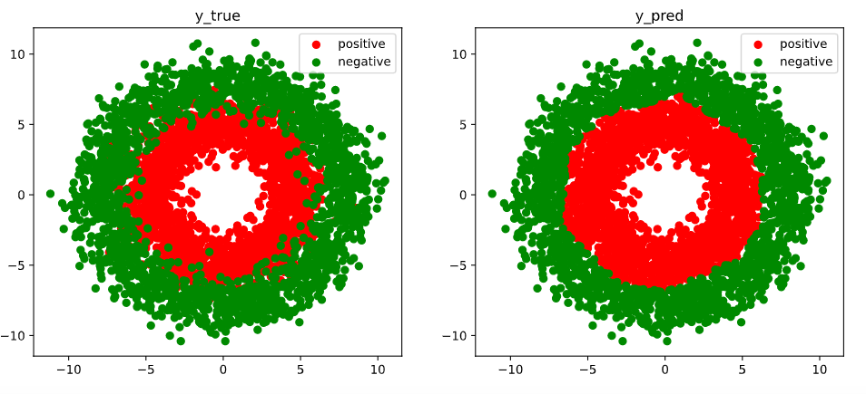

# KerasModel Example


You can install torchkeras using pip:
`pip install torchkeras`

Here is a complete examples using torchkeras.KerasModel! 

```python
import sys 
sys.path.append("..")
```

```python
import numpy as np 
import pandas as pd 
from matplotlib import pyplot as plt
import torch
from torch import nn
import torch.nn.functional as F
from torch.utils.data import Dataset,DataLoader,TensorDataset

import torchkeras #Attention this line 


```

### 1, prepare data 

```python
%matplotlib inline
%config InlineBackend.figure_format = 'svg'

#number of samples
n_positive,n_negative = 2000,2000

#positive samples
r_p = 5.0 + torch.normal(0.0,1.0,size = [n_positive,1]) 
theta_p = 2*np.pi*torch.rand([n_positive,1])
Xp = torch.cat([r_p*torch.cos(theta_p),r_p*torch.sin(theta_p)],axis = 1)
Yp = torch.ones_like(r_p)

#negative samples
r_n = 8.0 + torch.normal(0.0,1.0,size = [n_negative,1]) 
theta_n = 2*np.pi*torch.rand([n_negative,1])
Xn = torch.cat([r_n*torch.cos(theta_n),r_n*torch.sin(theta_n)],axis = 1)
Yn = torch.zeros_like(r_n)

#concat positive and negative samples
X = torch.cat([Xp,Xn],axis = 0)
Y = torch.cat([Yp,Yn],axis = 0)


#visual samples
plt.figure(figsize = (6,6))
plt.scatter(Xp[:,0],Xp[:,1],c = "r")
plt.scatter(Xn[:,0],Xn[:,1],c = "g")
plt.legend(["positive","negative"]);

```


```python
# split samples into train and valid data.
ds = TensorDataset(X,Y)
ds_train,ds_val = torch.utils.data.random_split(ds,[int(len(ds)*0.7),len(ds)-int(len(ds)*0.7)])
dl_train = DataLoader(ds_train,batch_size = 200,shuffle=True,num_workers=2)
dl_val = DataLoader(ds_val,batch_size = 200,num_workers=2)

```

```python
for features,labels in dl_train:
    break
print(features.shape)
print(labels.shape)

```

```python

```

### 2, create the  model

```python
class Net(nn.Module):  
    def __init__(self):
        super().__init__()
        self.fc1 = nn.Linear(2,4)
        self.fc2 = nn.Linear(4,8) 
        self.fc3 = nn.Linear(8,1)
        
    def forward(self,x):
        x = F.relu(self.fc1(x))
        x = F.relu(self.fc2(x))
        y = self.fc3(x) #don't need nn.Sigmoid()
        return y
        
net = Net()

from torchkeras.metrics import Accuracy 

```

```python

```

```python
model = torchkeras.KerasModel(net,
                              loss_fn = nn.BCEWithLogitsLoss(),
                              optimizer= torch.optim.Adam(net.parameters(),lr = 0.03),
                              metrics_dict = {"acc":Accuracy()}
                             )

from torchkeras import summary
summary(model,input_data=features);

```

```
--------------------------------------------------------------------------
Layer (type)                            Output Shape              Param #
==========================================================================
Linear-1                                     [-1, 4]                   12
Linear-2                                     [-1, 8]                   40
Linear-3                                     [-1, 1]                    9
==========================================================================
Total params: 61
Trainable params: 61
Non-trainable params: 0
--------------------------------------------------------------------------
Input size (MB): 0.000069
Forward/backward pass size (MB): 0.000099
Params size (MB): 0.000233
Estimated Total Size (MB): 0.000401
--------------------------------------------------------------------------

```

```python

```

### 3, train the model

```python
dfhistory=model.fit(epochs=30, train_data=dl_train, 
                    val_data=dl_val, patience=3, 
                    monitor="val_acc",mode="max",
                    ckpt_path='checkpoint.pt')

```

```python
# visual the results
fig, (ax1,ax2) = plt.subplots(nrows=1,ncols=2,figsize = (12,5))
ax1.scatter(Xp[:,0],Xp[:,1], c="r")
ax1.scatter(Xn[:,0],Xn[:,1],c = "g")
ax1.legend(["positive","negative"]);
ax1.set_title("y_true")

Xp_pred = X[torch.squeeze(F.sigmoid(model.forward(X))>=0.5)]
Xn_pred = X[torch.squeeze(F.sigmoid(model.forward(X))<0.5)]

ax2.scatter(Xp_pred[:,0],Xp_pred[:,1],c = "r")
ax2.scatter(Xn_pred[:,0],Xn_pred[:,1],c = "g")
ax2.legend(["positive","negative"]);
ax2.set_title("y_pred")

```




### 4, evaluate the model

```python
%matplotlib inline
%config InlineBackend.figure_format = 'svg'

import matplotlib.pyplot as plt

def plot_metric(dfhistory, metric):
    train_metrics = dfhistory["train_"+metric]
    val_metrics = dfhistory['val_'+metric]
    epochs = range(1, len(train_metrics) + 1)
    plt.plot(epochs, train_metrics, 'bo--')
    plt.plot(epochs, val_metrics, 'ro-')
    plt.title('Training and validation '+ metric)
    plt.xlabel("Epochs")
    plt.ylabel(metric)
    plt.legend(["train_"+metric, 'val_'+metric])
    plt.show()
```

```python
plot_metric(dfhistory,"loss")
```


```python
plot_metric(dfhistory,"acc")
```


```python
model.evaluate(dl_val)
```

```
{'val_loss': 0.18998068571090698, 'val_acc': 0.9300000071525574}
```


### 5, use the model

```python
F.sigmoid(model.predict(dl_val)[0:10]) 
```

```
tensor([[0.2218],
        [0.0424],
        [0.9959],
        [0.0155],
        [0.0824],
        [0.9820],
        [0.0013],
        [0.2190],
        [0.0043],
        [0.9928]])
```

```python
for features,labels in dl_val:
    with torch.no_grad():
        predictions = F.sigmoid(model.forward(features)) 
        print(predictions[0:10])
    break
```

```
tensor([[0.9979],
        [0.0011],
        [0.9782],
        [0.9675],
        [0.9653],
        [0.9906],
        [0.1774],
        [0.9994],
        [0.9178],
        [0.9579]])
```


### 6, save the model

```python
# save the model parameters

model_clone = torchkeras.KerasModel(Net(),loss_fn = nn.BCEWithLogitsLoss(),
             optimizer= torch.optim.Adam(model.parameters(),lr = 0.01),
             metrics_dict={"acc":Accuracy()})
model_clone.net.load_state_dict(torch.load("checkpoint.pt"))
model_clone.evaluate(dl_val)
```

```
{'val_loss': 0.1927894577383995, 'val_acc': 0.925000011920929}
```
