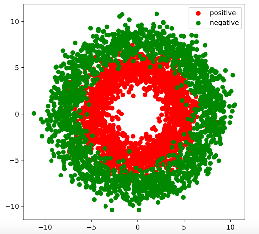

# LightModel Example


You can install torchkeras using pip:
`pip install torchkeras`

Here is a complete examples using torchkeras.LightModel 

```python
import sys 
sys.path.append("..")
```

```python
from torchkeras import LightModel 
```

```python
import numpy as np 
import pandas as pd 
from matplotlib import pyplot as plt
import torch
from torch import nn
import torch.nn.functional as F
from torch.utils.data import Dataset,DataLoader,TensorDataset

import torchkeras #Attention this line 


```

### 1, prepare data 

```python
%matplotlib inline
%config InlineBackend.figure_format = 'svg'

#number of samples
n_positive,n_negative = 2000,2000

#positive samples
r_p = 5.0 + torch.normal(0.0,1.0,size = [n_positive,1]) 
theta_p = 2*np.pi*torch.rand([n_positive,1])
Xp = torch.cat([r_p*torch.cos(theta_p),r_p*torch.sin(theta_p)],axis = 1)
Yp = torch.ones_like(r_p)

#negative samples
r_n = 8.0 + torch.normal(0.0,1.0,size = [n_negative,1]) 
theta_n = 2*np.pi*torch.rand([n_negative,1])
Xn = torch.cat([r_n*torch.cos(theta_n),r_n*torch.sin(theta_n)],axis = 1)
Yn = torch.zeros_like(r_n)

#concat positive and negative samples
X = torch.cat([Xp,Xn],axis = 0)
Y = torch.cat([Yp,Yn],axis = 0)


#visual samples
plt.figure(figsize = (6,6))
plt.scatter(Xp[:,0],Xp[:,1],c = "r")
plt.scatter(Xn[:,0],Xn[:,1],c = "g")
plt.legend(["positive","negative"]);

```



```python
# split samples into train and valid data.
ds = TensorDataset(X,Y)
ds_train,ds_val = torch.utils.data.random_split(ds,[int(len(ds)*0.7),len(ds)-int(len(ds)*0.7)])
dl_train = DataLoader(ds_train,batch_size = 200,shuffle=True,num_workers=2)
dl_val = DataLoader(ds_val,batch_size = 200,num_workers=2)

```

```python
for features,labels in dl_train:
    break
print(features.shape)
print(labels.shape)

```

```python

```

### 2, create the  model

```python
class Net(nn.Module):  
    def __init__(self):
        super().__init__()
        self.fc1 = nn.Linear(2,4)
        self.fc2 = nn.Linear(4,8) 
        self.fc3 = nn.Linear(8,1)
        
    def forward(self,x):
        x = F.relu(self.fc1(x))
        x = F.relu(self.fc2(x))
        y = self.fc3(x) #don't need nn.Sigmoid()
        return y
    
def create_net():
    net = Net()
    return net 
        
net = create_net() 


```

```python

```

```python
from torchkeras.metrics import Accuracy 

loss_fn = nn.BCEWithLogitsLoss()
metric_dict = {"acc":Accuracy()}

optimizer = torch.optim.Adam(net.parameters(), lr=0.03)
lr_scheduler = torch.optim.lr_scheduler.StepLR(optimizer, step_size=10, gamma=0.0001)

model = torchkeras.LightModel(net,
                   loss_fn = loss_fn,
                   metrics_dict= metric_dict,
                   optimizer = optimizer,
                   lr_scheduler = lr_scheduler,
                  )       

from torchkeras import summary
summary(model,input_data=features);

```

```
--------------------------------------------------------------------------
Layer (type)                            Output Shape              Param #
==========================================================================
Linear-1                                     [-1, 4]                   12
Linear-2                                     [-1, 8]                   40
Linear-3                                     [-1, 1]                    9
KerasModel-4                                 [-1, 1]                   61
==========================================================================
Total params: 122
Trainable params: 122
Non-trainable params: 0
--------------------------------------------------------------------------
Input size (MB): 0.000069
Forward/backward pass size (MB): 0.000107
Params size (MB): 0.000465
Estimated Total Size (MB): 0.000641
--------------------------------------------------------------------------

```

```python

```

### 3, train the model

```python
import pytorch_lightning as pl     

#1，设置回调函数
model_ckpt = pl.callbacks.ModelCheckpoint(
    monitor='val_loss',
    save_top_k=1,
    mode='min'
)

early_stopping = pl.callbacks.EarlyStopping(monitor = 'val_loss',
                           patience=5,
                           mode = 'min'
                          )

#2，设置训练参数

# gpus=0 则使用cpu训练，gpus=1则使用1个gpu训练，gpus=2则使用2个gpu训练，gpus=-1则使用所有gpu训练，
# gpus=[0,1]则指定使用0号和1号gpu训练， gpus="0,1,2,3"则使用0,1,2,3号gpu训练
# tpus=1 则使用1个tpu训练
trainer = pl.Trainer(logger=True,
                     min_epochs=3,max_epochs=10,
                     gpus=0,
                     callbacks = [model_ckpt,early_stopping],
                     enable_progress_bar = True) 

#断点续训
#trainer = pl.Trainer(resume_from_checkpoint='./lightning_logs/version_31/checkpoints/epoch=02-val_loss=0.05.ckpt')

##4，启动训练循环
trainer.fit(model,dl_train,dl_val)


```

```python
# visual the results
fig, (ax1,ax2) = plt.subplots(nrows=1,ncols=2,figsize = (12,5))
ax1.scatter(Xp[:,0],Xp[:,1], c="r")
ax1.scatter(Xn[:,0],Xn[:,1],c = "g")
ax1.legend(["positive","negative"]);
ax1.set_title("y_true")

Xp_pred = X[torch.squeeze(F.sigmoid(model.forward(X))>=0.5)]
Xn_pred = X[torch.squeeze(F.sigmoid(model.forward(X))<0.5)]

ax2.scatter(Xp_pred[:,0],Xp_pred[:,1],c = "r")
ax2.scatter(Xn_pred[:,0],Xn_pred[:,1],c = "g")
ax2.legend(["positive","negative"]);
ax2.set_title("y_pred")
```


### 4, evaluate the model

```python
%matplotlib inline
%config InlineBackend.figure_format = 'svg'

import matplotlib.pyplot as plt

def plot_metric(dfhistory, metric):
    train_metrics = dfhistory["train_"+metric]
    val_metrics = dfhistory['val_'+metric]
    epochs = range(1, len(train_metrics) + 1)
    plt.plot(epochs, train_metrics, 'bo--')
    plt.plot(epochs, val_metrics, 'ro-')
    plt.title('Training and validation '+ metric)
    plt.xlabel("Epochs")
    plt.ylabel(metric)
    plt.legend(["train_"+metric, 'val_'+metric])
    plt.show()
```

```python
dfhistory  = model.get_history() 
plot_metric(dfhistory,"loss")
```


```python
plot_metric(dfhistory,"acc")
```


```python
#使用最佳保存点进行评估
trainer.test(ckpt_path='best', dataloaders=dl_val,verbose = False)
```

```
{'val_loss': 0.18998068571090698, 'val_acc': 0.9300000071525574}
```


### 5, use the model

```python
predictions = F.sigmoid(torch.cat(trainer.predict(model, dl_val, ckpt_path='best'))) 
```

```python
def predict(model,dl):
    model.eval()
    result = torch.cat([model.forward(t[0]) for t in dl])
    return(result.data)

print(model.device)
predictions = F.sigmoid(predict(model,dl_val)[:10]) 

```

```
tensor([[0.2218],
        [0.0424],
        [0.9959],
        [0.0155],
        [0.0824],
        [0.9820],
        [0.0013],
        [0.2190],
        [0.0043],
        [0.9928]])
```


### 6, save the model

```python
print(trainer.checkpoint_callback.best_model_path)
print(trainer.checkpoint_callback.best_model_score)
```

```python
model_best = LightModel.load_from_checkpoint(trainer.checkpoint_callback.best_model_path)
```

```python
best_net = model_best.net 
torch.save(best_net.state_dict(),"best_net.pt")
```

```python
#加载权重
net_clone = create_net()
net_clone.load_state_dict(torch.load("best_net.pt"))
```

```python
#验证net_clone和model_best推理结果完全一致。
data,label = next(iter(dl_val))

model_best.eval()
net_clone.eval() 
with torch.no_grad():
    preds  = model_best(data)
    preds_clone = net_clone(data)
    
print("model_best prediction:\n",preds[0:10],"\n")
print("net_clone prediction:\n",preds_clone[0:10])
```

```
model_best prediction:
 tensor([[ 5.5149],
        [-3.8894],
        [ 4.8058],
        [ 5.0177],
        [-1.5002],
        [ 2.3319],
        [-5.4546],
        [-2.4411],
        [-4.8484],
        [ 3.4401]]) 

net_clone prediction:
 tensor([[ 5.5149],
        [-3.8894],
        [ 4.8058],
        [ 5.0177],
        [-1.5002],
        [ 2.3319],
        [-5.4546],
        [-2.4411],
        [-4.8484],
        [ 3.4401]])
```
